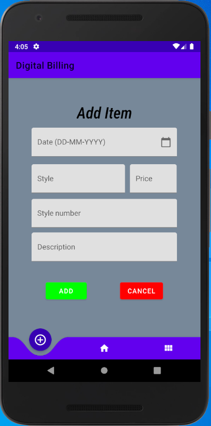
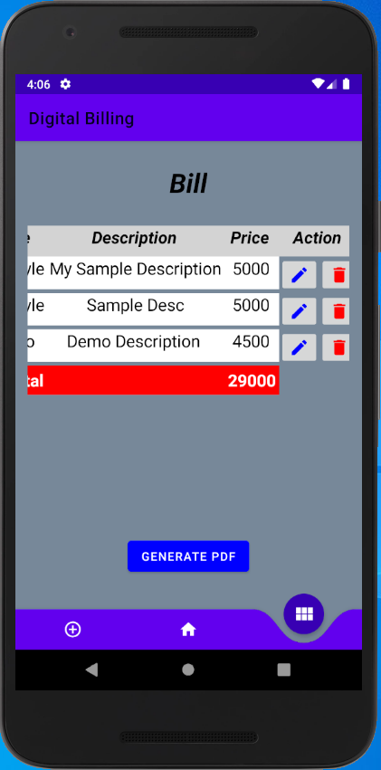

# Digital-Billing-System
> Simple billing system with Material design UI

## Introduction
It is a completely customized billing system for practice purpose with SQLite3 Database in backend

## Snapshot of the project

 

## Contributing

1. Fork [Digital Billing System](https://github.com/tauseefansari/Digital-Billing-System)
2. Create your feature branch (`git checkout -b feature/fooBar`)
3. Commit your changes (`git commit -am 'Add some fooBar'`)
4. Push to the branch (`git push origin feature/fooBar`)
5. Create a new Pull Request
